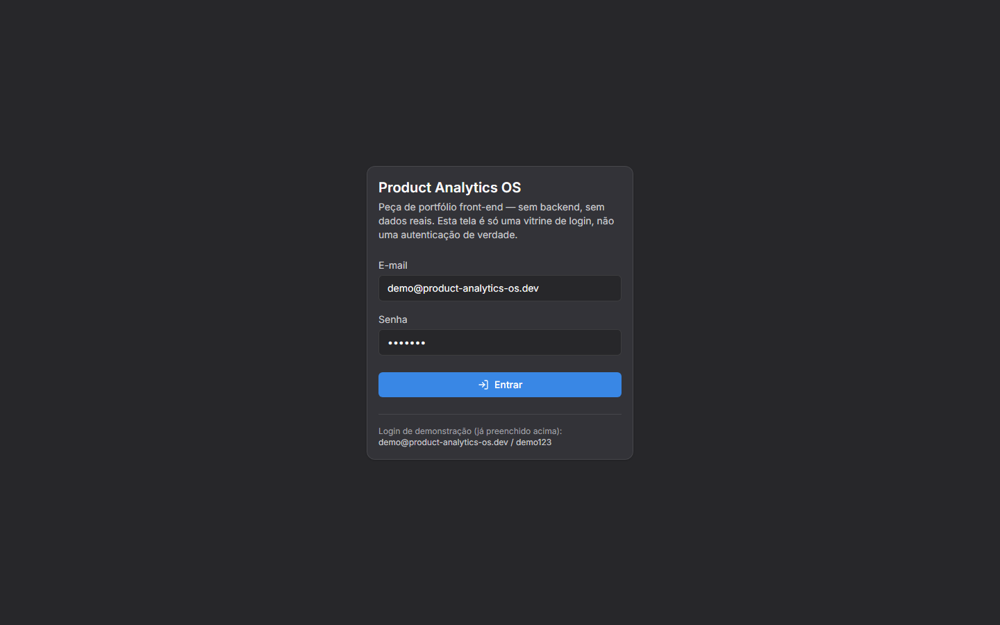
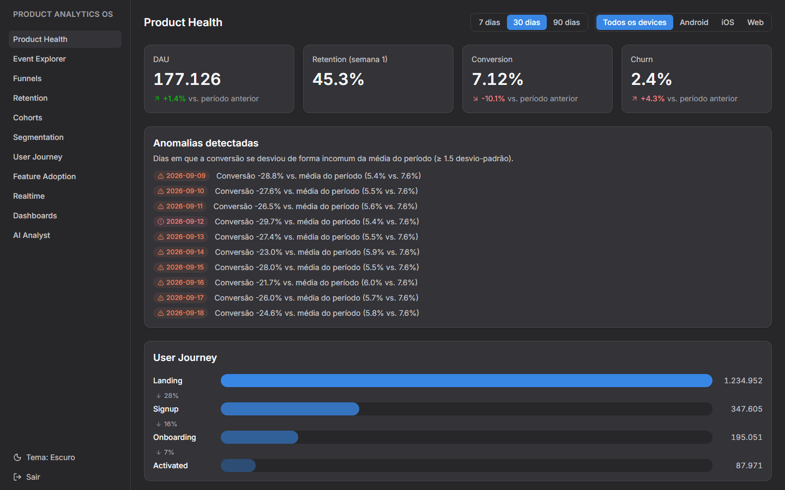
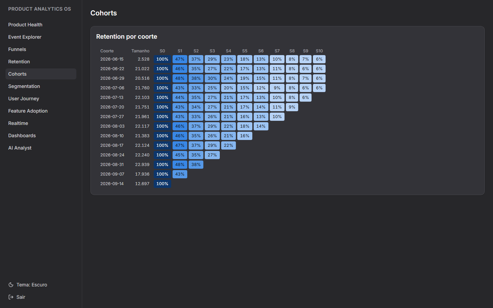
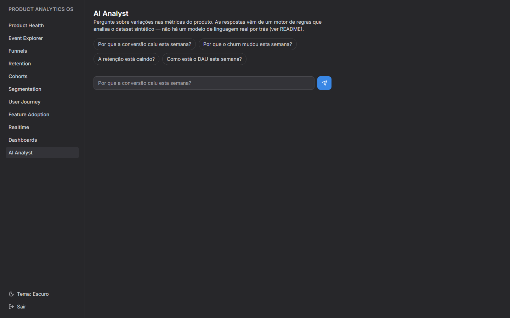

# Product Analytics OS

## O que é isso, em linguagem simples

Imagine um painel que mostra, em tempo real, como as pessoas usam um
aplicativo: quantas entraram hoje, quantas completaram o cadastro,
onde desistiram no meio do caminho, quais telas usam mais, se estão
voltando depois de uma semana. É esse tipo de painel — chamado de
"product analytics" — que empresas como o Mixpanel, o Amplitude e o
PostHog vendem para times de produto.

Este projeto é uma **recriação desse tipo de ferramenta**, construída
como peça de portfólio front-end. Ela tem dashboards, gráficos,
filtros de período/dispositivo e até um assistente ("AI Analyst") que
responde perguntas como _"por que a conversão caiu essa semana?"_
apontando a causa mais provável com números reais como evidência.

O detalhe importante: **não é um produto de verdade**. Não existe
servidor, não existe banco de dados, não existe nenhum usuário real
por trás — tudo o que você vê (métricas, eventos, o "raciocínio" do AI
Analyst) é gerado no próprio navegador por um simulador de dados
determinístico. A tela de login também é só uma vitrine: não autentica
nada de verdade, e por isso as credenciais já vêm preenchidas (mais
detalhes abaixo). O objetivo é demonstrar arquitetura de front-end,
UX de dados e qualidade de engenharia, não operar um serviço real.

## Links

- **Repositório**: https://github.com/saullobueno/product-analytics-os
- **Demo publicada (Vercel)**: https://product-analytics-os.vercel.app

## Acessando a demo

A tela de login (`/login`) não é uma autenticação real — é só uma
etapa de UX para simular a entrada num produto. Os campos de e-mail e
senha já chegam preenchidos com a credencial de demonstração, que
também fica visível no rodapé do próprio card de login; basta clicar
em "Entrar".

## Screenshots

As capturas abaixo estão em [`docs/screenshots/`](docs/screenshots/),
no tema escuro (padrão da aplicação).

| Login                                | Product Health                                         |
| ------------------------------------ | ------------------------------------------------------ |
|  |  |

| Cohorts                                  | AI Analyst                                     |
| ---------------------------------------- | ---------------------------------------------- |
|  |  |

## Funcionalidades

- **Login de demonstração**: tela de entrada com credencial fixa,
  pré-preenchida nos campos e repetida no rodapé do card — sem
  backend, é só uma vitrine (ver [`src/features/auth/`](src/features/auth/)).
- **Product Health**: DAU, retenção, conversão e churn com comparação
  vs. período anterior, funil de ativação (User Journey) e detecção de
  anomalias (desvio-padrão sobre a série diária de conversão).
- **AI Analyst**: pergunte "Por que a conversão caiu esta semana?" e
  receba fator primário, evidências e confiança — calculado de verdade
  a partir do dataset, não uma resposta fixa (ver
  [ADR 0005](docs/decisions/0005-ai-analyst-motor-de-regras.md)).
- **Event Explorer**, **Funnels**, **Retention**, **Cohorts** (heatmap),
  **Segmentation**, **User Journey**, **Feature Adoption**, **Realtime
  Events** — as demais seções de analytics, todas navegáveis pela
  sidebar.
- **Dashboards customizáveis**: widgets em drag/drop (dnd-kit) e
  relatórios salvos, persistidos em `localStorage`.
- **Dark mode** (padrão) e light mode, com paleta neutra do dark
  derivada de `#27272A` — ver [`src/index.css`](src/index.css) e
  [`src/lib/palette.ts`](src/lib/palette.ts).
- Filtros de período/device como **URL state**
  (`?range=30d&device=android`), compartilháveis e persistentes entre
  reloads.

## Stack

- [Vite](https://vite.dev) + [React 19](https://react.dev) + TypeScript
- [React Router](https://reactrouter.com) (data router, páginas com
  `React.lazy` — ver [ADR 0007](docs/decisions/0007-code-splitting-por-rota.md))
- [Zustand](https://zustand-demo.pmnd.rs) (tema, autenticação de demo, dashboard)
- [Recharts](https://recharts.org) (gráficos) + [dnd-kit](https://dndkit.com) (drag/drop)
- [oxlint](https://oxc.rs) (lint) + [Prettier](https://prettier.io) (formatação)
- [Tailwind CSS v4](https://tailwindcss.com)
- [Vitest](https://vitest.dev) + [Testing Library](https://testing-library.com)

Decisões de arquitetura documentadas em [`docs/decisions/`](docs/decisions/).

## Rodando localmente

```bash
npm install
npm run dev
```

## Scripts

| Script                 | Descrição                       |
| ---------------------- | ------------------------------- |
| `npm run dev`          | Servidor de desenvolvimento     |
| `npm run build`        | Typecheck + build de produção   |
| `npm run typecheck`    | Typecheck isolado (`tsc -b`)    |
| `npm run lint`         | Lint com oxlint                 |
| `npm run format`       | Formata com Prettier            |
| `npm run format:check` | Verifica formatação sem alterar |
| `npm run test`         | Testes em modo watch (Vitest)   |
| `npm run test:run`     | Testes em modo single-run (CI)  |
| `npm run preview`      | Preview do build de produção    |

## Estrutura

```
src/
  app/          shell da aplicação (nav/layout), roteamento, guard de
                acesso (RequireAuth), lazyPages.ts
  pages/        1 componente por rota (inclui LoginPage)
  features/     lógica + componentes por feature de domínio
                (auth, ai-analyst, dashboards, filters, product-health,
                cohorts, retention, segmentation, events, adoption,
                realtime, funnels)
  components/   design system / componentes de UI compartilhados
  data/         motor de dados sintéticos determinístico + seletores
  store/        estado global (Zustand: tema, autenticação de demo, dashboard)
  lib/          utilitários (PRNG, paleta de cores, formatação, cn)
```

## Status

Projeto construído incrementalmente por fases (scaffold → fundação →
fluxo principal → AI Analyst → dashboards/páginas restantes/polimento).
Todas as fases estão completas; acompanhe as decisões em
`docs/decisions/`. Simplificações deliberadas (não são limitações
técnicas, são escopo de portfólio):

- Sem multiusuário/persistência entre dispositivos — tudo local ao
  navegador (dataset determinístico + `localStorage`).
- Login sem backend: a credencial de demonstração é fixa e pública,
  só existe para simular a UX de entrada num produto.
- Widgets do dashboard usam um período fixo (30 dias, todos os
  devices), independente dos filtros de outras páginas.
- "Realtime Events" simula um feed ao vivo sobre um snapshot gerado
  uma vez por sessão, não uma conexão de verdade (não há backend).
